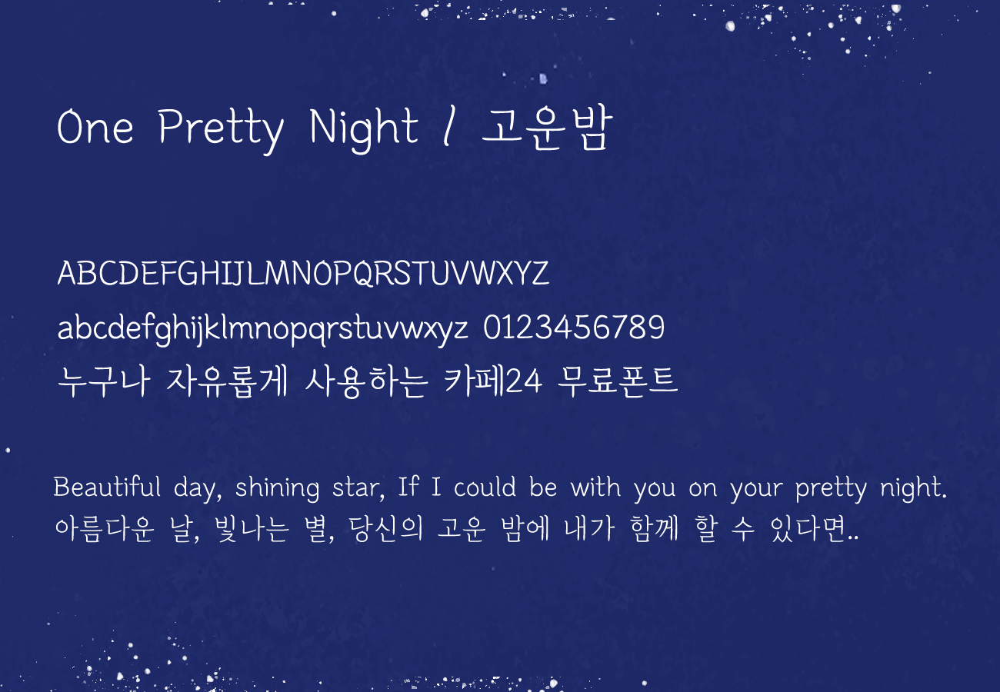

[[English]](./README.md)

# One Pretty Night
"One Pretty Night"은 한글 및 라틴확장을 지원하는 글꼴로 종이에 펜으로 편지를 쓰는 듯한 다정한 손맛이 느껴지는 것이 특징입니다.  
획의 처음은 꾹 눌러 쓴 돌기를 시작으로 천천히 내려긋고 맺음은 빠르게 써내려 하나의 획 안에서도 손글씨의 속도감을 느낄 수 있습니다.
특별히 한글 'ㅇ'의 획의 맺음과 'ㅁ'의 꺾임에 펜의 먹이 머무는 듯한 느낌을 주어 아날로그의 느낌을 살렸습니다.  
영문에도 동일한 특징을 담아 한글에 담겨져 있는 한국의 정취를 영문에서도 그대로 느끼실 수 있습니다.  
일반 스크립트 폰트에서 느낄 수 없는 One Pretty Night 만의 고요함과 부드러움으로 당신의 마음을 누군가에게 표현해보세요!  

## 샘플
  

## 라이선스
이 폰트는 SIL OPEN FONT LICENSE(Version 1.1)에 따라 사용이 허가됩니다.   

## 저자
[Cafe24 Corp.](https://fonts.cafe24.com) (fonts@cafe24corp.com)  
  
CAFE24 Corp 는 글로벌 전자상거래 플랫폼 기업입니다.  
창의가 있는 사람이라면 누구나 국내를 넘어 전 세계 시장에서 온라인 비즈니스가 가능할 수 있도록 쇼핑몰 솔루션, 광고∙마케팅, 호스팅 인프라 등 다양한 서비스를 원스톱 (One-Stop)으로 제공하고 있습니다. 

## Note
This is the open source GitHub repository for submission to Google Fonts.
