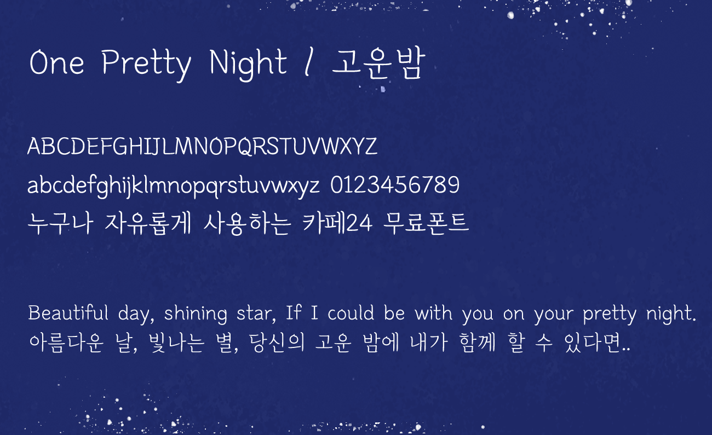

[[KOREAN]](./README-KR.md)

# One Pretty Night
“One Pretty Night” is a multi-script typeface that supports both Latin and Hangul (Korean), characterized by a tender handwritten feel reminiscent of pen on paper.  
Starting with a firmly pressed serif, each stroke slowly sweeps into an abrupt finish, capturing the speed and rhythm of real handwriting in every letter.  
Notably, the closures found in round letters like the Hangul ‘ㅇ’ and the bent ends in ‘ㅁ’ imitate lingering ink from a pen tip for an analog effect.  
The same features are applied to both scripts, imparting the unique Korean touch directly into Latin characters.  
Express your feelings with the serenity and softness of “One Pretty Night” unfound in any other script font.  

## Sample
  

## License
This Font Software is licensed under the SIL Open Font License, Version 1.1.

## Author
[Cafe24 Corp.](https://fonts.cafe24.com) (fonts@cafe24corp.com)  

Global E-commerce Platform Cafe24 provides IT solutions and business services including e-commerce solution, global marketing, and global logistics that are necessary for doing online business.  
Cafe24 offers a One-Stop platform so that merchants can focus on creative projects to achieve further business growth in the global e-commerce market.  
